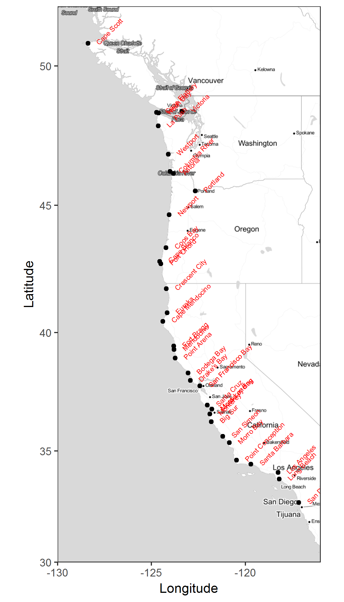
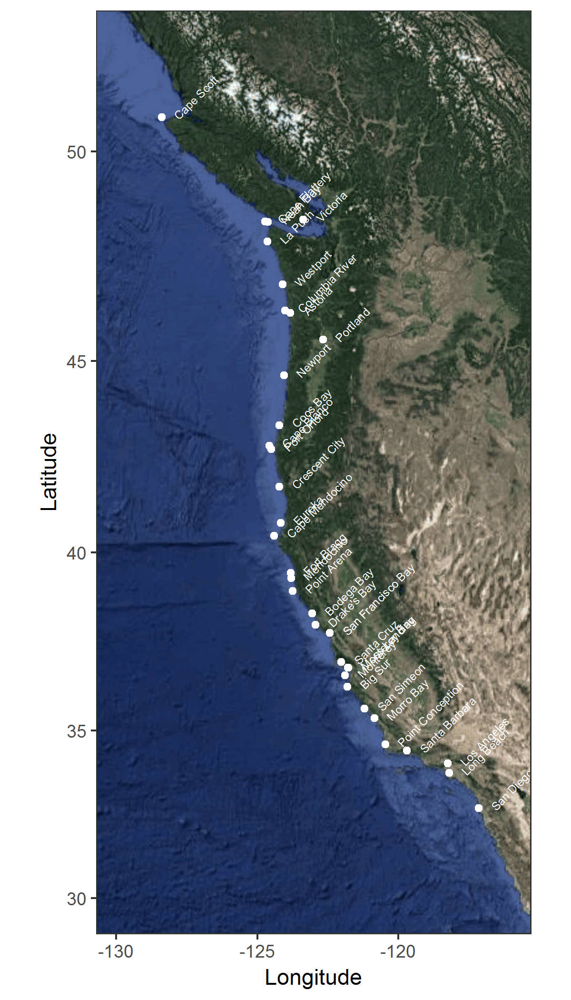
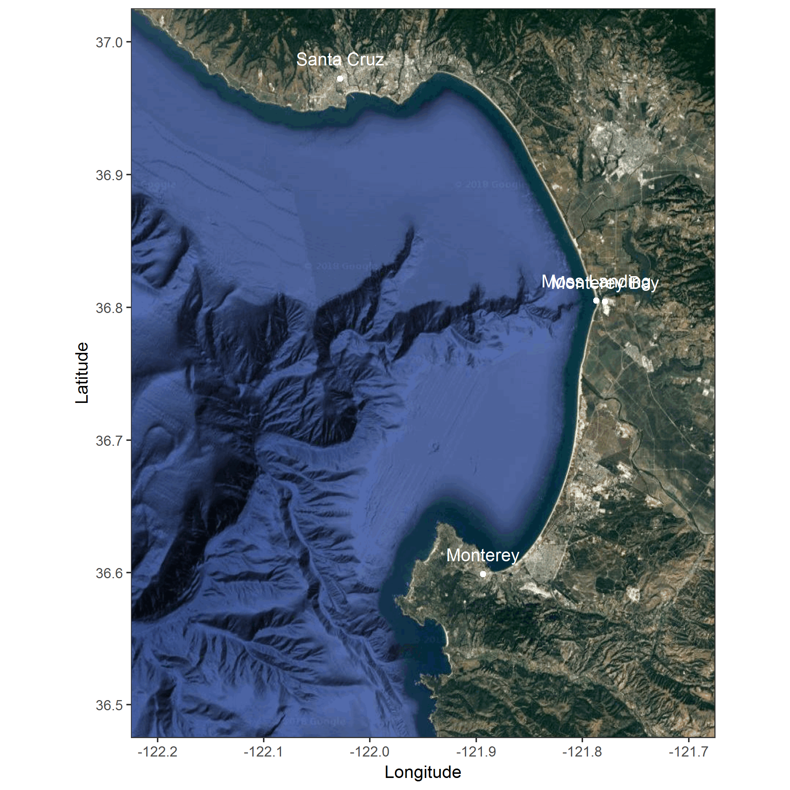

# Configure chunk options

```{r ChunkOptions}
# Set global knitr chunk options
if (.Platform$OS.type == "unix") {
  # Do not specify Cairo device for MacOS
  knitr::opts_chunk$set(warning = F, message = F)
} else {
  knitr::opts_chunk$set(warning = F, message = F, dev.args = list(type = "cairo"))
}
```

# Load libraries

```{r LoadLibraries}
library(tidyverse)
library(ggmap)
library(sf)
library(cowplot)
library(here)
library(knitr)
```


# Set map boundaries
```{r MapBounds}
# Define lat and long bounds for west coast map
wc.lat <- c(30, 52)
wc.long <- c(-130, -116)

# Define lat and long bounds for Monterey Bay
mb.lat <- c(36.5, 37)
mb.long <- c(-122.2, -121.7)

# Read locations
locations <- read_csv(here("Data/locations.csv")) %>% 
  filter(group %in% c("city", "landmark") )
```

# ggmap
## Stamen maps

```{r ggmapStamen, out.width='6in'}
# Set west coast boundaries for stamen maps
wc.stamen <- c(left = min(wc.long), bottom = min(wc.lat), 
               right = max(wc.long), top = max(wc.lat))
# Download stamen map of west coast
wc.map.stamen.toner <- get_stamenmap(wc.stamen, zoom = 6, maptype = "toner-lite") %>% 
  ggmap() + xlab("Longitude") + ylab("Latitude") + theme_bw()

# Add layers to map
wc.map.stamen.toner + 
  geom_point(data = locations, aes(long, lat)) +
  geom_text(data = locations, aes(long, lat, label = name))

wc.map.stamen.toner + 
  geom_point(data = locations, aes(long, lat)) +
  geom_text(data = locations, aes(long, lat, label = name), 
            colour = "red", size = 2, hjust = 0, nudge_x = 0.5, angle = 45)

# Save map
ggsave(filename = "../Figs/wc_map_stamen_toner.png", width = 4, height = 7)
# Print map

```

## Google maps

```{r ggmapGoogleMapsWC}
# Set west coast boundaries for stamen maps
wc.google <- c(mean(wc.long),mean(wc.lat))
# Download stamen map of west coast
wc.map.google <- get_map(location = wc.google, zoom = 4, source = "google", maptype = "satellite") %>% 
  ggmap() + xlab("Longitude") + ylab("Latitude") + theme_bw() +
  xlim(wc.long) + ylim(wc.lat)

wc.map.google +
 geom_point(data = locations, aes(long, lat), colour = "white") +
  geom_text(data = locations, aes(long, lat, label = name), 
            colour = "white", size = 2, hjust = 0, nudge_x = 0.5, angle = 45)
# Save map
ggsave(filename = "../Figs/wc_map_google.png", width = 4, height = 7)
# Print map

```

```{r ggmapGoogleMapsMB}
# Set west coast boundaries for stamen maps
mb.google <- c(mean(mb.long),mean(mb.lat))
# Download stamen map of west coast
mb.map.google <- get_map(location = mb.google, zoom = 10, source = "google", maptype = "satellite") %>% 
  ggmap() + xlab("Longitude") + ylab("Latitude") + theme_bw() +
  xlim(mb.long) + ylim(mb.lat)

mb.map.google +
 geom_point(data = locations, aes(long, lat), colour = "white") +
  geom_text(data = locations, aes(long, lat, label = name), 
            colour = "white", size = 4, vjust = 0, nudge_y = 0.01)
# Save map
ggsave(filename = "../Figs/mb_map_google.png", width = 7, height = 7)
# Print map

```